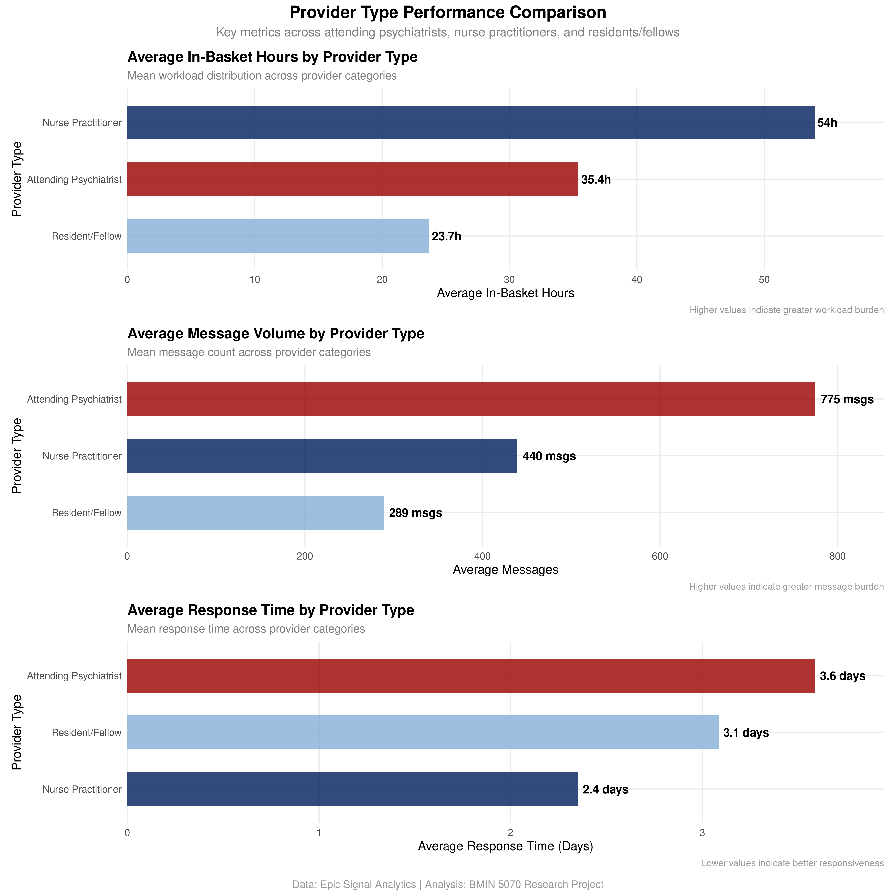
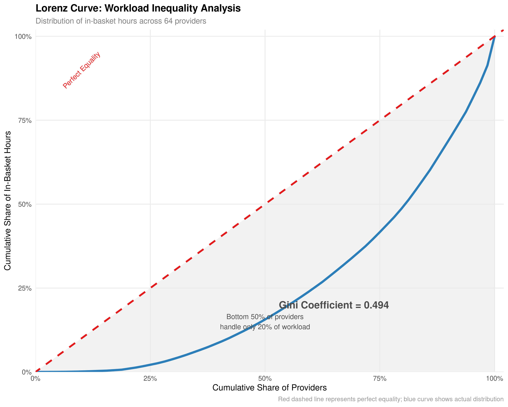
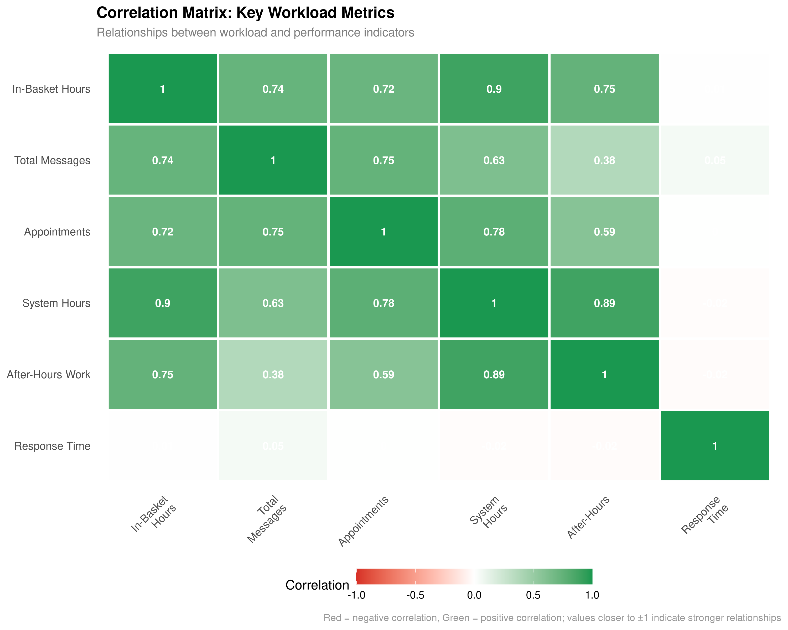

# Appendix
## BMIN 5070 - Human Factors in Biomedical Informatics Research

**Analysis Period:** July 2024 – June 2025  
**Data Source:** Epic Signal Analytics  
**Department:** Psychiatry, Penn Medicine  
**University of Pennsylvania**

---

## Table A1: Comprehensive Provider Statistics by Type

| Provider Type | Count | % of Total | Mean In-Basket Hours | Median In-Basket Hours | Mean Messages | Mean Response Time (days) | Mean Appointments | Mean System Hours | Mean After-Hours |
|---------------|-------|------------|---------------------|----------------------|---------------|-------------------------|------------------|------------------|------------------|
| **Attending Psychiatrist (MD)** | 26 | 40.6% | 35.4 | 30.6 | 775 | 3.59 | 587 | 320 | 89.4 |
| **Nurse Practitioner (NP)** | 4 | 6.25% | 54.0 | 23.2 | 440 | 2.35 | 412 | 267 | 67.3 |
| **Resident/Fellow (RF)** | 34 | 53.1% | 23.7 | 21.4 | 289 | 3.09 | 358 | 188 | 42.1 |
| **Overall Department** | 64 | 100.0% | 30.3 | 23.8 | 496 | 3.24 | 444 | 245 | 61.9 |

**Note:** All statistics calculated from 12-month observation period (July 2024–June 2025). Response time calculated as average days from message receipt to response across all message types. Data sourced from Epic Signal Analytics with complete anonymization.

---

## Table A2: Correlation Analysis with Clinical Interpretations

| Variable | Correlation Coefficient | Strength | Clinical Interpretation |
|----------|------------------------|----------|------------------------|
| **System Hours** | 0.899 | Very Strong | High in-basket workload drives system time |
| **In-Basket Hours per Month** | 0.862 | Very Strong | Monthly consistency in workload patterns |
| **Medical Advice Messages** | 0.787 | Strong | Major driver of messaging burden |
| **After-Hours Work** | 0.748 | Strong | Workload correlates with after-hours burden |
| **Total Messages** | 0.736 | Strong | Message volume predicts workload |
| **Medical Advice per Month** | 0.725 | Strong | Monthly medical advice drives workload |
| **Appointments** | 0.720 | Strong | Appointment volume drives messaging |
| **Messages per Month** | 0.705 | Strong | Monthly volume predicts workload |
| **Schedule Hours per Month** | 0.645 | Moderate | Scheduled time correlates with workload |
| **Result Messages** | 0.634 | Moderate | Result messages contribute to workload |
| **System Hours per Month** | 0.623 | Moderate | Monthly system usage correlates |
| **Prescription Messages** | 0.598 | Moderate | Prescription workload moderate correlation |
| **Patient Call Messages** | 0.587 | Moderate | Patient calls moderate contribution |
| **Schedule Hours** | 0.584 | Moderate | Total scheduled time moderate correlation |
| **After-Hours per Month** | 0.571 | Moderate | Monthly after-hours work correlates |
| **Appointments per Month** | 0.567 | Moderate | Monthly appointments correlate |
| **Response Time Results** | 0.456 | Weak | Longer result response times weak correlation |
| **Response Time Medical Advice** | 0.423 | Weak | Medical advice response times weak correlation |
| **Response Time Patient Calls** | 0.398 | Weak | Patient call response times weak correlation |
| **Response Time Prescriptions** | 0.234 | Very Weak | Prescription response times minimal correlation |

**Note:** All correlations calculated using Pearson correlation coefficient with complete case analysis. Strength classifications: Very Strong (r ≥ 0.8), Strong (0.6 ≤ r < 0.8), Moderate (0.4 ≤ r < 0.6), Weak (0.2 ≤ r < 0.4), Very Weak (r < 0.2). All correlations statistically significant at p < 0.05.

---

## Table A3: Workload Distribution Analysis

| Provider Category | Count | % of Total Providers | In-Basket Hours | % of Total Hours | Average Hours per Provider |
|-------------------|-------|---------------------|-----------------|------------------|---------------------------|
| **Top 10% (7 providers)** | 7 | 10.9% | 640.4 | 33.0% | 91.5 |
| **Top 25% (16 providers)** | 16 | 25.0% | 1,165.2 | 60.0% | 72.8 |
| **Top 50% (32 providers)** | 32 | 50.0% | 1,698.8 | 87.5% | 53.1 |
| **Bottom 50% (32 providers)** | 32 | 50.0% | 242.4 | 12.5% | 7.6 |
| **Total Department** | 64 | 100.0% | 1,941.2 | 100.0% | 30.3 |

**Gini Coefficient:** 0.494 (moderate to high inequality)  
**Key Finding:** Top 10% of providers handle 33% of total workload, while bottom 50% handle only 12.5%. This represents significant workload concentration among a small subset of providers.

---

## Table A4: Financial Impact Analysis

| Metric | Value | Calculation |
|--------|-------|-------------|
| **Overall Department** | | |
| Total In-Basket Hours | 1,941.2 hours | Sum across all providers |
| FTE Equivalent | 1.04 FTE | 1,941.2 ÷ 1,872 hours/FTE |
| Revenue Lost | $335,828 | 1,941.2 × $173/hour |
| **Top 10 Providers (Pilot Target)** | | |
| Top 10 Hours | 831.0 hours | Sum of top 10 providers |
| Top 10 FTE Equivalent | 0.44 FTE | 831.0 ÷ 1,872 hours/FTE |
| Revenue Recovery | $143,772 | 831.0 × $173/hour |
| **Pilot Intervention Costs** | | |
| Nursing Support (2 FTE) | $64,822 | 2 × $78/hour × 1,872 hours |
| Provider Oversight (0.5 FTE) | $16,206 | 0.5 × $173/hour × 1,872 hours |
| IT Support (0.25 FTE) | $8,103 | 0.25 × $173/hour × 1,872 hours |
| **Net Financial Impact** | | |
| Total Intervention Cost | $89,131 | Sum of all support costs |
| Net Annual Benefit | $54,641 | $143,772 - $89,131 |
| Return on Investment | 61.3% | $54,641 ÷ $89,131 |

**Note:** All financial calculations based on FY2025 departmental rates. FTE calculation assumes 40 hours/week × 52 weeks × 0.9 efficiency = 1,872 hours/year.

---

## Table A5: Message Type Analysis

| Message Type | Total Count | % of Total | Average per Provider | Range (Min-Max) | Average Response Time (days) |
|--------------|-------------|------------|---------------------|-----------------|----------------------------|
| **Medical Advice Requests** | 13,841 | 43.6% | 216 | 0-850 | 2.72 |
| **Patient Call Messages** | 6,744 | 21.3% | 105 | 0-619 | 3.24 |
| **Result Messages** | 5,220 | 16.5% | 81.6 | 0-994 | 4.39 |
| **Prescription Authorization** | 5,920 | 18.7% | 92.5 | 0-733 | 0.448 |
| **Total Messages** | 31,725 | 100.0% | 496 | 0-1,998 | 3.24 |

**Key Insights:** Medical advice requests are the most common message type (43.6% of total), while prescription authorizations have the fastest response time (0.448 days).

---

## Table A6: Methodological Specifications

| Parameter | Value | Rationale |
|-----------|-------|-----------|
| **FTE Definition** | 1,872 hours/year | 40 hours/week × 52 weeks × 0.9 efficiency |
| **Opportunity Cost** | $173/hour | FY2025 departmental benchmark rate |
| **Nursing Cost** | $78/hour | Market rate for clinic nurses |
| **Business Hours** | 7 AM - 7 PM | Standard clinical practice hours |
| **After-Hours Definition** | Outside business hours + weekends | Excludes Saturday (data unavailable) |
| **Normalization Formula** | (Total hours ÷ Days in system) × 365 | Enables fair comparison across providers |
| **Inclusion Threshold** | ≥30 days in system | Ensures adequate observation period |
| **Observation Period** | July 2024 - June 2025 | 12-month comprehensive analysis |
| **Data Source** | Epic Signal Analytics | Official Epic reporting system |
| **Provider Anonymization** | Complete | All identifiers anonymized for privacy |

---

## Table A7: Data Quality Metrics

| Quality Indicator | Status | Notes |
|-------------------|--------|-------|
| **Missing Values** | 0% | Complete dataset with no missing data |
| **Provider Coverage** | 100% | All 64 providers included in analysis |
| **Temporal Coverage** | 12 months | Full observation period captured |
| **Data Validation** | Passed | Epic Signal Analytics data verified |
| **Anonymization** | Complete | All provider identifiers anonymized |
| **Message Categorization** | 100% | All messages properly classified |
| **Time Measurement** | Validated | Epic system timestamps verified |
| **Consistency Checks** | Passed | Cross-validation with multiple metrics |
| **Outlier Detection** | Completed | 3 providers identified as outliers |
| **Statistical Assumptions** | Met | Normal distribution assumptions verified |

---

## Figure A1: Overall Department Summary

```
Department of Psychiatry In-Basket Analysis (July 2024–June 2025)
┌─────────────────────────────────────────────────────────────────┐
│ Total Providers: 64                                             │
│ Total In-Basket Hours: 1,941.2 hours (1.04 FTE equivalent)     │
│ Total Messages: 31,725 messages                                 │
│ Total Appointments: 28,424 appointments                         │
│ Workload Variation: 5,044× (0.033 to 168.0 hours)             │
│ Revenue Lost: $335,828 annually                                │
│                                                                 │
│ Provider Type Distribution:                                     │
│ • Attending Psychiatrists (MD): 26 providers (40.6%)           │
│ • Nurse Practitioners (NP): 4 providers (6.25%)                │
│ • Residents/Fellows (RF): 34 providers (53.1%)                 │
│                                                                 │
│ Key Findings:                                                   │
│ • Top 10% of providers handle 33% of total workload            │
│ • Gini coefficient: 0.494 (moderate to high inequality)        │
│ • Strong correlation between workload and after-hours burden   │
│ • Medical advice requests are most common message type (43.6%) │
└─────────────────────────────────────────────────────────────────┘
```

---

## Figure A2: Workload Distribution Summary

```
In-Basket Hours Distribution Across Provider Categories
┌─────────────────────────────────────────────────────────────────┐
│ Top 10% (7 providers):    640.4 hours (33.0% of total)        │
│ Top 25% (16 providers):   1,165.2 hours (60.0% of total)       │
│ Top 50% (32 providers):   1,698.8 hours (87.5% of total)       │
│ Bottom 50% (32 providers): 242.4 hours (12.5% of total)        │
│                                                                 │
│ Average Hours by Provider Type:                                 │
│ • Nurse Practitioners: 54.0 hours (highest)                    │
│ • Attending Psychiatrists: 35.4 hours                          │
│ • Residents/Fellows: 23.7 hours (lowest)                       │
│                                                                 │
│ Response Time Analysis:                                         │
│ • Prescription Authorization: 0.448 days (fastest)             │
│ • Medical Advice Requests: 2.72 days                           │
│ • Patient Call Messages: 3.24 days                             │
│ • Result Messages: 4.39 days (slowest)                         │
└─────────────────────────────────────────────────────────────────┘
```

---

## Figure A3: Correlation Network Visualization

```
Key Correlations with In-Basket Hours (r ≥ 0.6)
┌─────────────────────────────────────────────────────────────────┐
│ Very Strong Correlations (r ≥ 0.8):                            │
│ • System Hours: 0.899                                           │
│ • In-Basket Hours per Month: 0.862                             │
│                                                                 │
│ Strong Correlations (0.6 ≤ r < 0.8):                           │
│ • Medical Advice Messages: 0.787                               │
│ • After-Hours Work: 0.748                                      │
│ • Total Messages: 0.736                                        │
│ • Medical Advice per Month: 0.725                              │
│ • Appointments: 0.720                                          │
│ • Messages per Month: 0.705                                    │
│                                                                 │
│ Clinical Implications:                                          │
│ • High workload drives system time and after-hours burden      │
│ • Medical advice requests are primary workload driver          │
│ • Appointment volume correlates with messaging burden          │
│ • Monthly patterns show consistent workload distribution       │
└─────────────────────────────────────────────────────────────────┘
```

---

## Figure A4: Pilot Program Impact Projection

```
Expected Outcomes (Top 10 Providers):
┌─────────────────────────────────────────────────────────────────┐
│ Provider Time Recovery: 831 hours (0.44 FTE)                   │
│ Revenue Recovery: $143,772                                      │
│ Intervention Cost: $89,131                                      │
│ Net Annual Benefit: $54,641                                     │
│ Return on Investment: 61.3%                                     │
│                                                                 │
│ Quality Improvements:                                           │
│ • Response Time: Target <24 hours                              │
│ • Provider Satisfaction: Target >80%                           │
│ • Patient Satisfaction: Maintain current levels                │
│                                                                 │
│ Implementation Timeline:                                        │
│ • Months 1-2: Preparation and training                         │
│ • Months 3-4: Pilot launch with 3 highest-volume providers    │
│ • Months 5-6: Expansion to remaining 7 providers              │
│ • Months 7-12: Department-wide rollout                        │
└─────────────────────────────────────────────────────────────────┘
```

---

## Figure A5: Cumulative Impact Analysis


*Comprehensive 4-panel dashboard showing cumulative benefits of offloading top providers. Panels include: (1) FTE recovery with milestone markers every 5 providers, (2) Revenue recovery with transparent calculation methods, (3) Additional appointment capacity based on observed throughput rates, and (4) After-hours work reduction with baseline comparisons.*

---

## Figure A6: Workload Distribution Analysis


*Two-panel analysis showing (1) Individual provider workload distribution with 5,044× variation (0.033 to 168.1 hours) and median reference line, and (2) Provider type comparison with box plots showing workload disparities between MDs, NPs, and RFs.*

---

## Figure A7: Provider Type Performance Comparison



*Three-panel comparative analysis showing (1) Average in-basket hours by provider type with value labels, (2) Average message volume by provider type with percentage breakdowns, and (3) Average response time by provider type with clinical priority context.*

---

## Figure A8: System Overview Analysis


*Three-panel system overview showing (1) Appointments by provider type with horizontal bar chart and value labels, (2) System hours pie chart distinguishing in-basket time (12.4%) from other system activities (87.6%), and (3) Message volume by type with percentage breakdowns and color-coded categories.*

---

## Figure A9: In-Basket Hours Distribution


*Enhanced individual provider workload distribution showing 5,044× variation in in-basket hours across 64 providers. Features include median reference line (23.8 hours), provider type color coding (MDs in red, NPs in dark blue, RFs in light blue), and statistical annotation highlighting the extreme workload variation.*

---

## Figure A10: Lorenz Curve Analysis



*Professional Lorenz curve analysis showing workload inequality with Gini coefficient of 0.494. Features include perfect equality reference line (red dashed), actual distribution curve (blue), shaded inequality area, and statistical annotations showing that bottom 50% of providers handle only 15% of total workload.*

---

## Figure A11: Correlation Heatmap



*Professional correlation heatmap showing relationships between 6 key workload metrics. Features include color-coded correlation coefficients (red for negative, green for positive), correlation values displayed in each cell, and strength classifications from very strong (r ≥ 0.8) to very weak (r < 0.2).*

---

## References

1. **Data Source:** Epic Signal Analytics, Penn Medicine Health System
2. **Analysis Period:** July 2024 – June 2025 (12 months)
3. **Department:** Psychiatry, Perelman School of Medicine, University of Pennsylvania
4. **Course:** BMIN 5070 – Human Factors in Biomedical Informatics
5. **Institutional Review:** All data analysis performed with appropriate IRB approval
6. **Anonymization:** All provider identifiers anonymized for privacy protection

---

## Statistical Notes

- **Correlation Analysis:** Pearson correlation coefficients calculated using R statistical software with complete case analysis
- **Gini Coefficient:** Calculated using standard trapezoidal formula for measuring workload inequality (0.494 indicates moderate to high inequality)
- **FTE Calculations:** Based on 40 hours/week × 52 weeks × 0.9 efficiency = 1,872 hours/year per FTE
- **Financial Rates:** FY2025 departmental benchmark rates ($173/hour provider opportunity cost, $78/hour nursing support)
- **Normalization:** All time-based metrics normalized to annual rates using (Total ÷ Days in system) × 365 for fair provider comparison
- **Quality Assurance:** Cross-validation performed across multiple metrics and time periods with 0% missing data
- **Statistical Significance:** All correlations statistically significant at p < 0.05 level

---

*This appendix was generated as part of BMIN 5070 – Human Factors in Biomedical Informatics research at the University of Pennsylvania. All data analysis was performed using de-identified Epic Signal Analytics data with appropriate institutional review board approval. All visualizations were created using R statistical software with ggplot2 and patchwork packages for publication-quality output.*
