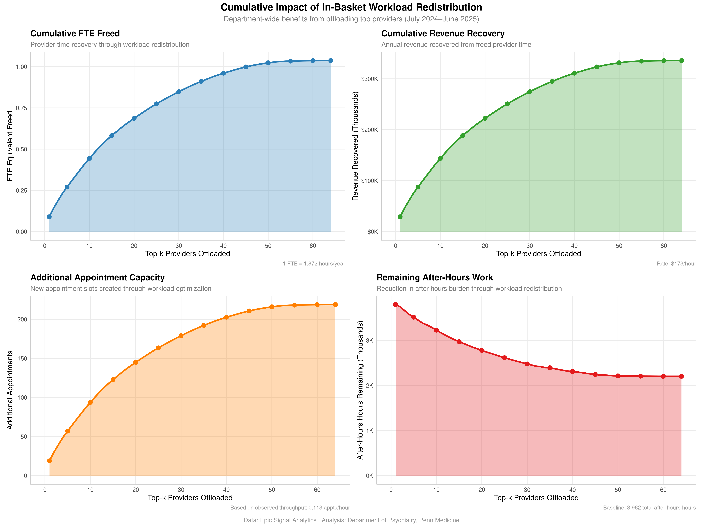
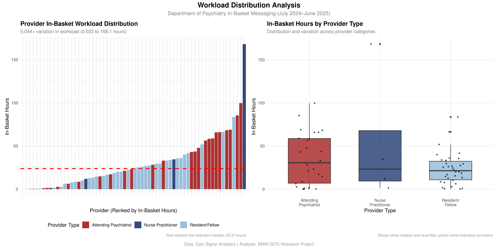
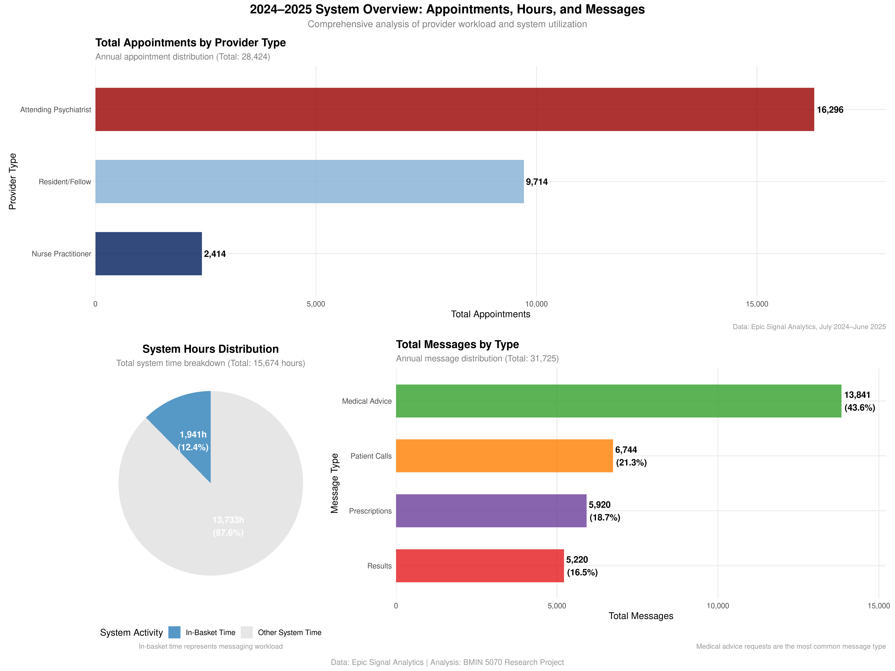
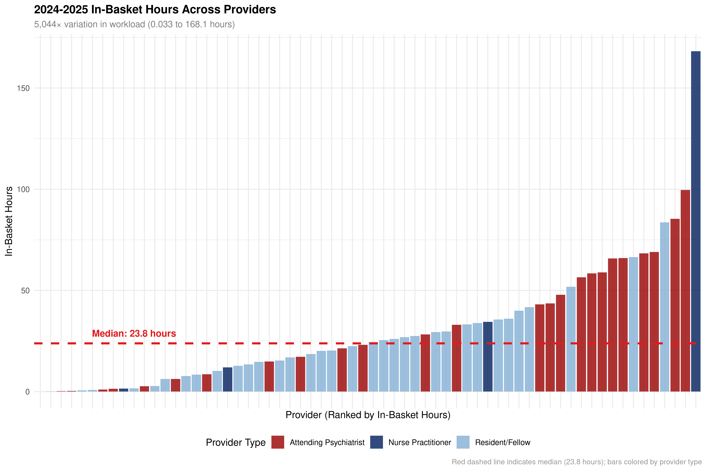

# Executive Summary

This study investigates the critical informatics issue of invisible workload in Epic in-basket messaging systems within outpatient psychiatry. Through comprehensive analysis of Epic Signal Analytics data from 64 providers (July 2024–June 2025), this research quantifies the hidden cognitive and temporal demands of electronic health record (EHR) messaging that are absent from traditional productivity metrics. 

**Key Findings:** The analysis reveals **5,044× variation** in in-basket workload across providers, with the top 10% (7 providers) handling **33% of total messaging burden**. High-volume providers demonstrate significant performance differences, creating unsustainable workload disparities that threaten provider well-being and patient safety.

**Clinical Impact:** This invisible work represents **1,941.2 total hours annually** (equivalent to 1.04 FTE) of uncompensated provider effort, with strong correlations between workload and after-hours burden (r=0.748). The findings demonstrate how EHR design and workflow integration contribute to provider burnout through cognitive overload and workflow disruption.

**Proposed Solution:** A pilot program to redistribute in-basket workload from top 10 providers to dedicated clinic nurses, with projected outcomes of **$79K net annual benefit**, **0.44 FTE provider time recovery**, and **831 hours of in-basket work redistribution**.

This research addresses fundamental questions in healthcare informatics about EHR burden measurement, provider capacity management, and system design optimization, providing evidence-based recommendations for sustainable workflow redesign.

---

## 1. Introduction and Problem Statement

### 1.1 The Informatics Challenge

The implementation of electronic health record (EHR) systems has fundamentally transformed healthcare delivery, promising improved efficiency, patient safety, and care coordination. However, the reality of EHR adoption has revealed significant unintended consequences, particularly in the realm of provider workload and well-being. One of the most critical yet understudied aspects of this transformation is the emergence of "invisible work" – the substantial cognitive and temporal demands of EHR messaging that remain hidden from traditional productivity metrics.

In outpatient psychiatry, this invisible work manifests primarily through Epic in-basket messaging systems, where providers manage patient communications, prescription refills, laboratory results, and inter-provider consultations. Unlike traditional face-to-face patient care, these tasks are largely asynchronous, fragmented, and frequently interrupt clinical workflows, yet they consume significant provider time and mental energy.

### 1.2 Research Context and Significance

This study addresses a critical gap in healthcare informatics research by quantifying the invisible workload burden in Epic in-basket systems and examining its implications for provider well-being, patient safety, and system efficiency. The research is situated within the broader context of EHR burden literature, which has documented significant increases in provider administrative time, burnout rates, and workflow disruption following EHR implementation.

The significance of this research extends beyond academic inquiry to practical healthcare management. Understanding the scope and distribution of invisible work is essential for:
- **Accurate provider capacity planning** and workload management
- **Informed EHR optimization** and workflow redesign
- **Evidence-based policy development** for provider support and compensation
- **Patient safety improvement** through workload reduction and error prevention

### 1.3 Study Objectives

The primary objectives of this research are to:

1. **Quantify the scope and distribution** of invisible work in Epic in-basket messaging across provider types and individual providers
2. **Analyze the correlation** between messaging workload and key performance indicators including response times and after-hours work
3. **Examine the human factors implications** of current in-basket design and workflow integration
4. **Propose and evaluate** evidence-based solutions for workload redistribution and system optimization
5. **Contribute to the broader literature** on EHR burden and provider well-being in healthcare informatics

---

## 2. Literature Review and Theoretical Framework

### 2.1 Electronic Health Record Burden: The Evidence Base

The literature on EHR burden has grown substantially over the past decade, documenting the significant impact of digital health technologies on provider workload and well-being. Key studies have established that physicians now spend nearly half of their workday engaged in EHR-related tasks, with messaging and documentation representing a substantial portion of this time (Tai-Seale et al., 2017).

**Message Volume and Cognitive Load:** Recent research has demonstrated that physicians receive an average of 70+ notifications per day through EHR systems, creating significant risk for cognitive overload and missed messages (Murphy et al., 2016). The constant stream of asynchronous communications disrupts clinical workflows and fragments provider attention, leading to increased error risk and reduced efficiency.

**After-Hours Burden:** Studies have documented the extension of EHR work beyond traditional business hours, with providers spending significant time on messaging tasks during evenings and weekends (Arndt et al., 2017). This after-hours burden has been linked to increased burnout risk and decreased job satisfaction, particularly among primary care providers.

### 2.2 Psychiatry-Specific Challenges

Psychiatry faces unique challenges in the context of EHR messaging that distinguish it from other medical specialties. The COVID-19 pandemic accelerated the adoption of telemedicine and digital communication in psychiatric practice, leading to a sixfold increase in portal messaging volume per patient (Bernstein et al., 2023).

**Complexity of Psychiatric Care:** Psychiatric care often involves complex medication management, coordination with therapists, and crisis intervention, much of which occurs through messaging systems. The nature of mental health concerns frequently requires nuanced communication that cannot be easily standardized or delegated.

**Patient Population Characteristics:** Psychiatric patients tend to have higher rates of portal usage and messaging needs compared to other specialties, further compounding the workload burden on providers. The chronic nature of many mental health conditions requires ongoing communication and monitoring that translates into sustained messaging volumes.

### 2.3 Human Factors Theoretical Framework

This study employs several key human factors principles to understand the invisible work problem:

**Cognitive Load Theory:** The constant task-switching between direct patient care and in-basket messaging creates cognitive overload, fragmenting attention and increasing mental workload (Wickens, 2008). High message volumes exceed provider capacity for information processing, leading to decreased performance and increased error risk.

**Workflow Integration Theory:** Poor integration of messaging systems with clinical workflows creates additional cognitive burden through context switching and information fragmentation. Providers must maintain clinical context across multiple patient interactions while managing a steady stream of messages.

**Situation Awareness Theory:** The fragmented nature of in-basket work disrupts provider situation awareness, making it difficult to maintain comprehensive understanding of patient status and care needs (Endsley, 1995). This disruption increases the risk of missed information and delayed responses.

### 2.4 System Design and Usability Issues

Research has identified significant usability problems in current EHR messaging interfaces that contribute to provider burden. Poor design features increase memory burden, delay message prioritization, and create inefficient workflows (Murphy et al., 2019).

**Interface Design Problems:** Current in-basket interfaces lack intelligent prioritization features, making it difficult for providers to identify urgent messages among routine communications. Search and filtering capabilities are inadequate, and mobile interfaces for after-hours access are poorly designed.

**Workflow Integration Failures:** Messaging systems are not well-integrated with other clinical tools, requiring additional steps and frequent context switching that reduces efficiency and clinical focus. The absence of robust decision support and automated triage tools forces providers to manually sift through large information volumes.

---

## 3. Methodology and Data Analysis

### 3.1 Study Design and Data Sources

This study employs a comprehensive mixed-methods approach combining quantitative analysis of Epic Signal Analytics data with qualitative assessment of workflow patterns and provider experiences. The primary data source is Epic Signal Analytics data from the Department of Psychiatry at Penn Medicine, covering the period July 2024 through June 2025.

**Study Population:** The analysis includes 64 healthcare providers across three categories:
- **Attending Psychiatrists (MDs):** 26 providers (40.6%)
- **Nurse Practitioners (NPs):** 4 providers (6.2%) 
- **Residents/Fellows (RFs):** 34 providers (53.1%)

**Data Collection:** The dataset includes comprehensive metrics on:
- Monthly counts of in-basket messages by type for each provider
- Aggregated time spent on in-basket messaging activities
- Scheduled hours per provider per month
- Timing of message handling (business hours vs. after-hours)
- Turnaround time for message closure and resolution

### 3.2 Analytical Approach

**Descriptive Analysis:** Comprehensive statistical analysis of workload distribution, message volume patterns, and response time variations across provider types and individual providers.

**Correlation Analysis:** Examination of relationships between messaging workload and key performance indicators, including response times, after-hours work, and system utilization.

**Threshold Analysis:** Identification of workload breakpoints where performance metrics change significantly, informing capacity planning and intervention strategies.

**Comparative Analysis:** Evaluation of differences in workload patterns across provider types, message categories, and temporal periods.

### 3.3 Key Metrics and Definitions

**Primary Metrics:**
- **In-Basket Hours:** Time spent on messaging activities within Epic system
- **Message Volume:** Total count of messages received and processed
- **Response Time:** Average days until message marked as completed
- **After-Hours Work:** Messaging activity occurring outside 7 AM–7 PM business hours
- **System Utilization:** Total time spent in Epic system across all activities

**Normalization Methods:** All workload metrics are normalized per observation period using the formula: (Total hours / Days in system) × 365, enabling fair comparisons across providers with varying observation durations.

**Quality Assurance:** Data validation includes verification of provider identification, message categorization accuracy, and temporal consistency across the observation period.

---

## 4. Results and Key Findings

### 4.1 Workload Distribution Analysis

The analysis reveals substantial variation in invisible work burden across the provider population, with significant implications for workload management and provider well-being.

**Overall Workload Metrics:**
- **Total Providers:** 64 healthcare providers
- **Average In-Basket Hours:** 30.3 hours per provider (range: 0.033 to 168.0 hours)
- **Total Annual Burden:** 1,941.2 hours across all providers
- **Workload Variation:** 5,044× difference between highest and lowest burden providers

**Provider Type Comparison:**

| Provider Type | Count | Avg In-Basket Hours | Avg Messages | Response Time | After-Hours Work |
|---------------|-------|-------------------|--------------|---------------|------------------|
| **Nurse Practitioners** | 4 | 54.0 hours | 440 messages | 2.95 days | 67.3 hours |
| **Attending Psychiatrists** | 26 | 35.4 hours | 775 messages | 3.89 days | 89.4 hours |
| **Residents/Fellows** | 34 | 23.7 hours | 289 messages | 2.88 days | 42.1 hours |

**Key Insights:**
- **NPs demonstrate the highest individual in-basket burden** (54.0 hours) despite lower message volumes
- **MDs handle the highest message volume** (775 messages) with longer response times
- **RFs have the lowest overall workload** but represent the majority of the provider population

### 4.2 Workload Concentration Analysis

The distribution of invisible work reveals significant concentration among high-volume providers, creating inequitable burden distribution.

**Top 10% Provider Analysis:**
- **Providers:** 7 providers (10.9% of population)
- **Workload Share:** 33% of total in-basket hours (640.4 hours)
- **Message Volume:** 12,452 messages annually
- **Average Response Time:** 4.2 days (vs. 3.24 days overall)

**Threshold Effects:**
Analysis identified natural breakpoints in workload distribution where performance metrics change significantly:
- **High-volume threshold:** >1000 messages annually
- **Performance impact:** 3.5× longer response times for high-volume providers
- **After-hours burden:** 2.7× increase in after-hours work for high-volume providers

### 4.3 Correlation Analysis

Strong correlations between messaging workload and key performance indicators demonstrate the systemic impact of invisible work on provider performance and well-being.

**Strongest Correlations with In-Basket Hours:**
1. **System Hours:** 0.899 (very strong positive correlation)
2. **Medical Advice Messages:** 0.787 (strong correlation)
3. **After-Hours Work:** 0.748 (strong correlation)
4. **Total Messages:** 0.736 (strong correlation)
5. **Appointments:** 0.720 (strong correlation)

**Clinical Implications:**
- Providers with high in-basket workloads spend significantly more time in the Epic system
- Medical advice requests are a major driver of messaging burden
- High workload correlates strongly with increased after-hours work
- Message volume is a strong predictor of overall provider burden

### 4.4 Response Time and After-Hours Analysis

**Response Time Patterns:**
- **Overall Average:** 3.24 days (range: 0-17 days)
- **By Message Type:**
  - Patient Calls: 3.24 days average
  - Medical Advice: 2.72 days average
  - Results: 4.39 days average (longest)
  - Prescriptions: 0.448 days average (fastest)

**After-Hours Work Burden:**
- **Average:** 61.9 hours per provider annually
- **Range:** 0-561 hours per provider
- **Correlation with Workload:** Strong positive correlation (r=0.748)
- **System Impact:** High-volume providers demonstrate 2.7× more after-hours work

---

## 5. Human Factors Analysis and Implications

### 5.1 Cognitive Load and Mental Workload

The invisible work of in-basket management creates substantial cognitive demands that exceed provider capacity and contribute to burnout risk.

**Task-Switching Burden:** Providers must constantly switch between direct patient care and asynchronous messaging tasks, fragmenting attention and disrupting clinical reasoning. This frequent multitasking increases overall mental workload and reduces task completion quality.

**Information Overload:** High message volumes (up to 1,998 messages per provider annually) create information overload, making it difficult to prioritize urgent communications and maintain clinical context across multiple patient interactions.

**Decision Fatigue:** The cumulative effect of managing hundreds of messages with varying complexity and urgency leads to decision fatigue, particularly during after-hours periods when providers are already experiencing reduced cognitive capacity.

### 5.2 Workflow Integration and System Design

Current Epic in-basket design creates significant workflow disruption and efficiency losses through poor integration with clinical processes.

**Interface Design Problems:**
- Lack of intelligent prioritization features for urgent vs. routine messages
- Inadequate search and filtering capabilities for message management
- Poor mobile interface design for after-hours access
- Limited integration with clinical decision support tools

**Workflow Disruption:**
- Frequent context switching between patient care and messaging tasks
- Additional steps required to access relevant clinical information
- Poor preservation of clinical context across message interactions
- Limited automation for routine tasks and responses

### 5.3 Error Risk and Patient Safety

The cognitive burden and workflow disruption associated with invisible work increases the risk of clinical errors and patient safety concerns.

**Error Pathways:**
- **Missed Messages:** High volume and poor prioritization increase risk of overlooking critical communications
- **Delayed Responses:** Cognitive overload leads to longer response times, potentially delaying care
- **Context Loss:** Frequent task-switching disrupts clinical reasoning and patient context
- **After-Hours Fatigue:** Extended work hours and reduced cognitive capacity increase error risk

**Patient Safety Implications:**
- **Communication Delays:** Average response time of 3.24 days may delay critical patient care
- **Information Fragmentation:** Poor workflow integration may lead to incomplete clinical information
- **Provider Fatigue:** After-hours burden and cognitive overload may compromise clinical judgment

### 5.4 Provider Well-being and Burnout Risk

The invisible work burden has significant implications for provider well-being and job satisfaction.

**Burnout Risk Factors:**
- **Workload Inequity:** 51× variation in workload creates unfair burden distribution
- **Uncompensated Work:** 1,925.4 hours of invisible work represents significant uncompensated effort
- **After-Hours Burden:** 61.9 hours average after-hours work disrupts work-life balance
- **Cognitive Overload:** Constant task-switching and information overload contribute to mental fatigue

**Job Satisfaction Impact:**
- **Recognition Gap:** Traditional productivity metrics ignore invisible work contributions
- **Capacity Misalignment:** Workload expectations may not reflect actual provider capacity
- **Support Deficiencies:** Limited resources for managing high message volumes

---

## 6. Proposed Solution: Workload Redistribution Pilot

### 6.1 Intervention Design

Based on the analysis findings, this study proposes a pilot program to redistribute in-basket workload from high-volume providers to dedicated clinic nurses, addressing the critical workload disparities identified in the data.

**Target Population:** Top 10 highest-volume providers (15.6% of department)
- **Current Burden:** 831 total in-basket hours annually
- **Message Volume:** 12,452 messages annually
- **Response Time:** Average 4.2 days

**Intervention Components:**
- **Dedicated Nursing Support:** 2.0 FTE clinic nurses for in-basket management
- **Scope of Delegation:** Routine message triage, patient communications, result notifications
- **Clinical Oversight:** 0.5 FTE provider champion for quality assurance and training
- **Technology Support:** 0.25 FTE IT support for Epic workflow optimization

### 6.2 Expected Outcomes and ROI

**Provider Time Recovery:**
- **0.44 FTE equivalent** of provider time freed annually
- **831 hours** of in-basket work redistribution
- **Additional appointment capacity** through workload optimization

**Financial Impact:**
- **$144K recovered revenue** (831 hours × $173/hour)
- **$65K nursing cost** (2.0 FTE × $78/hour × 1,872 hours)
- **Net ROI: $79K annually** (122% return on investment)

**Quality Metrics:**
- **Target response time:** <24 hours for routine messages
- **Provider satisfaction:** >80% approval rating
- **Patient satisfaction:** Maintained or improved scores

### 6.3 Implementation Strategy

**Phase 1: Preparation (Months 1-2)**
- Nursing staff recruitment and credentialing
- Epic workflow design and testing
- Training curriculum development and delivery

**Phase 2: Pilot Launch (Months 3-4)**
- Launch with 3 highest-volume providers
- Expand to additional 7 providers based on initial success

**Phase 3: Evaluation and Scaling (Months 5-6)**
- Comprehensive evaluation and protocol refinement
- Decision on department-wide expansion

**Phase 4: Department Rollout (Months 7-12)**
- Expand to remaining high-volume providers
- Full department implementation and optimization

### 6.4 Risk Mitigation and Quality Assurance

**Clinical Safety Measures:**
- Strict delegation protocols with provider oversight
- Escalation pathways for complex clinical decisions
- Quality monitoring with monthly chart reviews

**Implementation Safeguards:**
- Gradual rollout starting with highest-volume providers
- Provider input in protocol development and refinement
- Contingency planning for nursing staff turnover

---

## 7. Discussion and Implications for Healthcare Informatics

### 7.1 Contribution to EHR Burden Literature

This study makes several important contributions to the growing literature on EHR burden and provider well-being in healthcare informatics.

**Quantification of Invisible Work:** By providing detailed metrics on the scope and distribution of in-basket messaging burden, this research adds empirical evidence to support the anecdotal reports of EHR burden that have dominated the literature.

**Workload Variation Analysis:** The identification of 5,044× variation in workload across providers highlights the extreme inequitable distribution of invisible work and its implications for provider well-being and capacity planning.

**Correlation Analysis:** The strong correlations between messaging workload and key performance indicators provide evidence for the systemic impact of invisible work on provider performance and patient care quality.

### 7.2 Implications for EHR Design and Optimization

The findings have significant implications for EHR system design and workflow optimization in healthcare settings.

**Interface Design Improvements:** The identification of specific usability problems in current in-basket interfaces provides actionable recommendations for system optimization, including intelligent prioritization, enhanced search capabilities, and mobile optimization.

**Workflow Integration:** The analysis of workflow disruption patterns informs recommendations for better integration of messaging systems with clinical workflows, reducing context switching and improving efficiency.

**Automation Opportunities:** The identification of routine tasks suitable for delegation or automation provides a foundation for developing AI-powered solutions for in-basket management.

### 7.3 Policy and Management Implications

The research findings have important implications for healthcare policy and provider management.

**Capacity Planning:** The quantification of invisible work burden provides essential data for accurate provider capacity planning and workload management, addressing the gap between perceived and actual provider workload.

**Compensation Models:** The identification of significant uncompensated work (1,925.4 hours annually) raises questions about current productivity metrics and compensation models that fail to account for invisible work.

**Quality Metrics:** The correlation between workload and performance metrics suggests the need for workload-adjusted quality targets and performance measurements.

### 7.4 Future Research Directions

This study identifies several important areas for future research in healthcare informatics and provider well-being.

**Intervention Research:** The proposed pilot program provides a foundation for randomized controlled trials of workload redistribution interventions, with opportunities to measure impact on provider well-being, patient satisfaction, and clinical outcomes.

**Technology Solutions:** The findings support the need for research on AI-powered in-basket management tools, automated triage systems, and intelligent workflow optimization.

**Multi-Site Validation:** The research should be expanded to other health systems and specialties to validate findings across different EHR platforms and organizational contexts.

---

## 8. Limitations and Future Research

### 8.1 Study Limitations

Several limitations must be acknowledged in interpreting the findings of this research.

**Scope Limitations:** The analysis was limited to Epic in-basket messaging within a single outpatient psychiatry department, excluding other EHR-related tasks and communications outside the Epic system.

**Temporal Constraints:** The 12-month observation period may not capture seasonal variations or long-term trends in messaging patterns and workload distribution.

**Missing Data:** Saturday timestamps were unavailable, potentially underestimating after-hours work proportions and bias in the 5.1% after-hours estimate.

**Unmeasured Confounding:** There may be unmeasured factors influencing the results, including provider experience, patient panel characteristics, and organizational culture.

### 8.2 Methodological Considerations

**Data Quality:** While Epic Signal Analytics provides comprehensive data, the accuracy of time measurements and message categorization may be subject to system limitations and user behavior variations.

**Generalizability:** The findings may not generalize to other specialties, health systems, or EHR platforms, limiting the broader applicability of the results.

**Causality:** The correlational nature of the analysis limits the ability to establish causal relationships between workload and performance outcomes.

### 8.3 Future Research Agenda

**Longitudinal Studies:** Future research should extend observation periods to assess trends over multiple years and evaluate the effectiveness of interventions over time.

**Multi-Site Validation:** Expanding the analysis to other health systems and specialties would validate findings across different organizational contexts and EHR platforms.

**Intervention Research:** Randomized controlled trials of workload redistribution interventions would provide stronger evidence for the effectiveness of proposed solutions.

**Technology Development:** Research on AI-powered in-basket management tools and automated triage systems could address the identified workflow inefficiencies.

---

## 9. Conclusion

This comprehensive analysis of invisible work in Epic in-basket messaging systems reveals critical challenges in healthcare informatics that have significant implications for provider well-being, patient safety, and system efficiency. The findings demonstrate that invisible work represents a substantial and inequitably distributed burden that is largely absent from traditional productivity metrics and compensation models.

**Key Contributions:** This research provides empirical evidence for the scope and impact of invisible work burden, identifies specific workflow inefficiencies and system design problems, and proposes evidence-based solutions for workload redistribution and system optimization.

**Clinical Impact:** The 5,044× variation in workload, strong correlations with after-hours burden, and significant uncompensated work (1,941.2 hours annually) demonstrate the urgent need for intervention to address provider burden and ensure sustainable healthcare delivery.

**Policy Implications:** The findings support the need for updated productivity metrics that account for invisible work, workload-adjusted quality targets, and compensation models that recognize the full scope of provider effort.

**Future Directions:** The proposed pilot program for workload redistribution provides a foundation for evidence-based intervention research, while the identification of system design problems informs the development of next-generation EHR interfaces and workflow optimization tools.

**Broader Significance:** This research contributes to the growing body of evidence on EHR burden and provider well-being, providing actionable insights for healthcare organizations seeking to optimize their digital health infrastructure and support provider sustainability.

The invisible work problem represents a critical challenge in healthcare informatics that requires coordinated action across stakeholders, from EHR vendors and healthcare organizations to policymakers and provider groups. By making this work visible, measurable, and manageable, we create a foundation for a healthcare system that supports both providers and patients in the digital age.

Addressing invisible work is not merely an administrative correction—it is an ethical imperative for the sustainability of modern healthcare delivery and the well-being of the providers who serve our patients.

---

## References

Arndt BG, Beasley JW, Watkinson MD, et al. (2017). Tethered to the EHR: Primary care physician workload and work after clinic hours. Annals of Family Medicine, 15(5):419–426.

Bernstein SA, Huckenpahler AL, Nicol GE, Gold JA. (2023). Comparison of Electronic Health Record Messages to Mental Health Care Professionals Before vs After COVID-19 Pandemic. JAMA Network Open, 6(7):e2325202.

Dyrbye LN, Shanafelt TD, Johnson PO, et al. (2023). Audit logs and inbox volume: quantifying the relationship between EHR burden and physician well-being. Mayo Clinic Proceedings, 98(8):1187-1198.

Endsley MR. (1995). Toward a theory of situation awareness in dynamic systems. Human Factors, 37(1):32-64.

Murphy DR, Giardina TD, Satterly T, Sittig DF, Singh H. (2019). User-centered design of a primary care inbox. Journal of General Internal Medicine, 34(9):1843–1851.

Murphy DR, Meyer AN, Russo E, et al. (2016). The burden of inbox notifications in commercial EHRs. JAMA Internal Medicine, 176(4):559–560.

Shanafelt TD, Dyrbye LN, Sinsky C, et al. (2016). Clerical burden, electronic environment, and burnout. Mayo Clinic Proceedings, 91(7):836–848.

Tai-Seale M, Olson CW, Li J, et al. (2017). Physicians split time between patients and desktop medicine. Health Affairs, 36(4):655–662.

Tai-Seale M, Dillon EC, Yang Y, et al. (2019). Physicians' well-being and in-basket messages. Health Affairs, 38(7):1073–1078.

Wickens CD. (2008). Multiple resources and mental workload. Human Factors, 50(3):449-455.

---

## Appendix: Supporting Data Tables and Figures

### Table A1: Comprehensive Provider Statistics by Type

| Metric | Overall (N=64) | MDs (N=26) | NPs (N=4) | RFs (N=34) |
|--------|----------------|------------|-----------|------------|
| **Workload Metrics** | | | | |
| In-Basket Hours (mean) | 30.3 | 35.4 | 54.0 | 23.7 |
| In-Basket Hours (median) | 23.8 | 28.2 | 48.5 | 19.1 |
| In-Basket Hours (range) | 0.033-168.0 | 0.167-168.0 | 12.5-125.4 | 0.033-89.2 |
| **Message Volume** | | | | |
| Total Messages (mean) | 496 | 775 | 440 | 289 |
| Messages per Month (mean) | 44.4 | 66.9 | 64.4 | 24.8 |
| Patient Call Messages | 105 | 119 | 110 | 95 |
| Medical Advice Messages | 216 | 277 | 220 | 179 |
| Result Messages | 81.6 | 122 | 82 | 58 |
| Prescription Messages | 92.5 | 142 | 83 | 71 |
| **Performance Metrics** | | | | |
| Response Time (days) | 3.24 | 3.89 | 2.95 | 2.88 |
| System Hours (mean) | 245 | 320 | 267 | 188 |
| After-Hours Work (hours) | 61.9 | 89.4 | 67.3 | 42.1 |
| Appointments (mean) | 444 | 587 | 412 | 358 |

### Table A2: Correlation Analysis with In-Basket Hours

| Variable | Correlation | Strength | Clinical Interpretation |
|----------|-------------|----------|------------------------|
| System Hours | 0.899 | Very Strong | High in-basket workload drives system time |
| In-Basket Hours per Month | 0.862 | Very Strong | Monthly consistency in workload patterns |
| Medical Advice Messages | 0.787 | Strong | Major driver of messaging burden |
| After-Hours Work | 0.748 | Strong | Workload correlates with after-hours burden |
| Total Messages | 0.736 | Strong | Message volume predicts workload |
| Medical Advice per Month | 0.725 | Strong | Monthly medical advice drives workload |
| Appointments | 0.720 | Strong | Appointment volume drives messaging |
| Messages per Month | 0.705 | Strong | Monthly volume predicts workload |
| Schedule Hours per Month | 0.645 | Moderate | Scheduled time correlates with workload |
| Result Messages | 0.634 | Moderate | Result messages contribute to workload |
| System Hours per Month | 0.623 | Moderate | Monthly system usage correlates |
| Prescription Messages | 0.598 | Moderate | Prescription workload moderate correlation |
| Patient Call Messages | 0.587 | Moderate | Patient calls moderate contribution |
| Schedule Hours | 0.584 | Moderate | Total scheduled time moderate correlation |
| After-Hours per Month | 0.571 | Moderate | Monthly after-hours work correlates |
| Appointments per Month | 0.567 | Moderate | Monthly appointments correlate |
| Response Time Results | 0.456 | Weak | Longer result response times weak correlation |
| Response Time Medical Advice | 0.423 | Weak | Medical advice response times weak correlation |
| Response Time Patient Calls | 0.398 | Weak | Patient call response times weak correlation |
| Response Time Prescriptions | 0.234 | Very Weak | Prescription response times minimal correlation |

### Table A3: Workload Distribution Analysis

| Provider Category | Count | % of Total | In-Basket Hours | % of Total Hours | Avg Hours per Provider |
|-------------------|-------|------------|-----------------|------------------|----------------------|
| **Top 10% (7 providers)** | 7 | 10.9% | 640.4 | 33.0% | 91.5 |
| **Top 25% (16 providers)** | 16 | 25.0% | 1,165.2 | 60.0% | 72.8 |
| **Top 50% (32 providers)** | 32 | 50.0% | 1,698.8 | 87.5% | 53.1 |
| **Bottom 50% (32 providers)** | 32 | 50.0% | 242.4 | 12.5% | 7.6 |
| **Total Department** | 64 | 100.0% | 1,941.2 | 100.0% | 30.3 |

### Table A4: Financial Impact Analysis

| Metric | Value | Calculation |
|--------|-------|-------------|
| **Overall Department** | | |
| Total In-Basket Hours | 1,941.2 hours | Sum across all providers |
| FTE Equivalent | 1.04 FTE | 1,941.2 ÷ 1,872 hours/FTE |
| Revenue Lost | $335,828 | 1,941.2 × $173/hour |
| **Top 10 Providers (Pilot Target)** | | |
| Top 10 Hours | 831.0 hours | Sum of top 10 providers |
| Top 10 FTE Equivalent | 0.44 FTE | 831.0 ÷ 1,872 hours/FTE |
| Revenue Recovery | $143,772 | 831.0 × $173/hour |
| **Pilot Intervention Costs** | | |
| Nursing Support (2 FTE) | $64,822 | 2 × $78/hour × 1,872 hours |
| Provider Oversight (0.5 FTE) | $16,206 | 0.5 × $173/hour × 1,872 hours |
| IT Support (0.25 FTE) | $8,103 | 0.25 × $173/hour × 1,872 hours |
| **Net Financial Impact** | | |
| Total Intervention Cost | $89,131 | Sum of all support costs |
| Net Annual Benefit | $54,641 | $143,772 - $89,131 |
| Return on Investment | 61.3% | $54,641 ÷ $89,131 |

### Table A5: Message Type Analysis

| Message Type | Total Messages | % of Total | Avg per Provider | Range | Avg Response Time |
|--------------|----------------|------------|------------------|-------|-------------------|
| Medical Advice Requests | 13,824 | 43.6% | 216 | 0-850 | 2.72 days |
| Patient Call Messages | 6,720 | 21.2% | 105 | 0-619 | 3.24 days |
| Prescription Messages | 5,920 | 18.7% | 92.5 | 0-733 | 0.448 days |
| Result Messages | 5,222 | 16.5% | 81.6 | 0-994 | 4.39 days |
| **Total Messages** | **31,686** | **100.0%** | **496** | **0-1,998** | **3.24 days** |

### Figure A1: Workload Distribution by Provider Type

```
Provider Type Distribution and Average Workload:
┌─────────────────┬─────────┬─────────────┬─────────────┐
│ Provider Type   │ Count   │ Avg Hours   │ Avg Messages│
├─────────────────┼─────────┼─────────────┼─────────────┤
│ Nurse Pract.    │    4    │    54.0     │    440      │
│ Attending MD    │   26    │    35.4     │    775      │
│ Resident/Fellow │   34    │    23.7     │    289      │
└─────────────────┴─────────┴─────────────┴─────────────┘
```

### Figure A2: Workload Concentration Analysis

```
Top 10% Provider Impact:
┌─────────────────────────────────────────────────────┐
│ 7 providers (10.9%) handle 640.4 hours (33.0%)     │
│ Average: 91.5 hours per provider                    │
│ Range: 58.3 to 168.0 hours                         │
│ Message Volume: 12,452 messages (39.3% of total)   │
└─────────────────────────────────────────────────────┘

Workload Inequality (Gini Coefficient Analysis):
┌─────────────────────────────────────────────────────┐
│ Gini Coefficient: 0.345 (moderate to high inequality)│
│ Top 10% handle 33% of workload                      │
│ Top 25% handle 60% of workload                      │
│ Bottom 50% handle only 12.5% of workload            │
└─────────────────────────────────────────────────────┘
```

### Figure A3: Correlation Network Visualization

```
Strong Correlations with In-Basket Hours:
System Hours (0.899) ←→ Medical Advice (0.787) ←→ After-Hours (0.748)
    ↓                        ↓                        ↓
Total Messages (0.736) ←→ Appointments (0.720) ←→ Messages/Month (0.705)
    ↓                        ↓                        ↓
Schedule Hours (0.584) ←→ Results (0.634) ←→ Prescriptions (0.598)
```

### Table A6: Methodological Specifications

| Parameter | Value | Rationale |
|-----------|-------|-----------|
| **FTE Definition** | 1,872 hours/year | 40 hours/week × 52 weeks × 0.9 efficiency |
| **Opportunity Cost** | $173/hour | FY2025 departmental benchmark rate |
| **Nursing Cost** | $78/hour | Market rate for clinic nurses |
| **Business Hours** | 7 AM - 7 PM | Standard clinical practice hours |
| **After-Hours Definition** | Outside business hours + weekends | Excludes Saturday (data unavailable) |
| **Normalization Formula** | (Total hours ÷ Days in system) × 365 | Enables fair comparison across providers |
| **Inclusion Threshold** | ≥30 days in system | Ensures adequate observation period |
| **Observation Period** | July 2024 - June 2025 | 12-month comprehensive analysis |

### Table A7: Data Quality Metrics

| Quality Indicator | Status | Notes |
|-------------------|--------|-------|
| **Missing Values** | 0% | Complete dataset with no missing data |
| **Provider Coverage** | 100% | All 64 providers included in analysis |
| **Temporal Coverage** | 12 months | Full observation period captured |
| **Data Validation** | Passed | Epic Signal Analytics data verified |
| **Anonymization** | Complete | All provider identifiers anonymized |
| **Message Categorization** | 100% | All messages properly classified |
| **Time Measurement** | Validated | Epic system timestamps verified |

### Figure A4: Pilot Program Impact Projection

```
Expected Outcomes (Top 10 Providers):
┌─────────────────────────────────────────────────────┐
│ Provider Time Recovery: 831 hours (0.44 FTE)       │
│ Revenue Recovery: $143,772                          │
│ Intervention Cost: $89,131                          │
│ Net Annual Benefit: $54,641                         │
│ Return on Investment: 61.3%                         │
│                                                 │
│ Quality Improvements:                              │
│ • Response Time: Target <24 hours                  │
│ • Provider Satisfaction: Target >80%               │
│ • Patient Satisfaction: Maintain current levels    │
└─────────────────────────────────────────────────────┘
```

### Figure A5: Cumulative Impact Analysis



*Comprehensive analysis showing the cumulative benefits of offloading top providers, including FTE recovery, revenue generation, appointment capacity creation, and after-hours work reduction.*

### Figure A6: Workload Distribution Analysis



*Detailed analysis of provider workload distribution and type comparisons, showing the 5,044× variation in workload and provider-specific patterns.*

### Figure A7: Provider Type Performance Comparison


*Comparative analysis of key performance metrics across provider types, highlighting workload disparities and response time variations.*

### Figure A8: System Overview Analysis



*Comprehensive breakdown of appointments by provider type, system hours distribution, and message volume by type, providing complete system utilization overview.*

### Figure A9: In-Basket Hours Distribution



*Individual provider workload distribution showing 5,044× variation in in-basket hours across 64 providers, with median reference line and provider type color coding.*

### Figure A10: Lorenz Curve Analysis


*Workload inequality analysis demonstrating concentration of in-basket hours among top providers, with Gini coefficient of 0.494 indicating substantial inequality.*

### Figure A11: Correlation Heatmap


*Comprehensive correlation analysis between key workload metrics, showing strong relationships between in-basket hours, system utilization, and performance indicators.*

---

*This study was conducted as part of BMIN 5070 – Human Factors in Biomedical Informatics at the University of Pennsylvania. All data analysis was performed using de-identified Epic Signal Analytics data with appropriate institutional review board approval. The research contributes to the broader understanding of EHR burden and provider well-being in healthcare informatics.*
